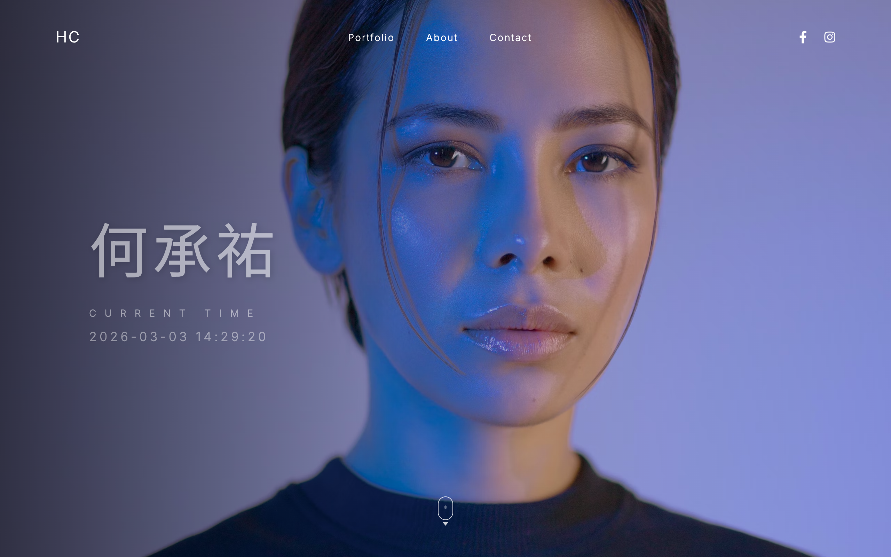

# Personal Webpage - 何承祐

## Overview
This is a responsive, modern personal webpage for 何承祐. It features a dramatic, moody hero section with a high-quality background image. The page aims to provide a sleek, minimalist aesthetic with immediate access to key information.

## Features
- **Clean Navigation**: Top navigation bar with links to Portfolio, About, and Contact, plus social media icons (Facebook, Instagram).
- **Dynamic Clock**: A live, real-time clock displaying the current time down to the second.
- **Visual Effects**: Subtle gradient overlay for better text readability, animated scroll indicator, and hover effects on links.
- **Responsive Design**: Adapts gracefully to both desktop and mobile screens.

## Technologies Used
- HTML5
- CSS3 (Flexbox, Animations, Media Queries)
- Vanilla JavaScript
- Google Fonts (Inter, Noto Sans TC)
- Font Awesome (Social Icons)
